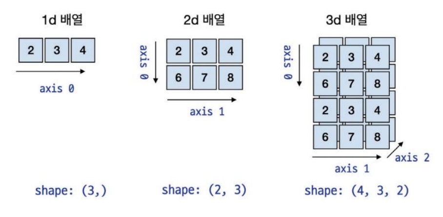
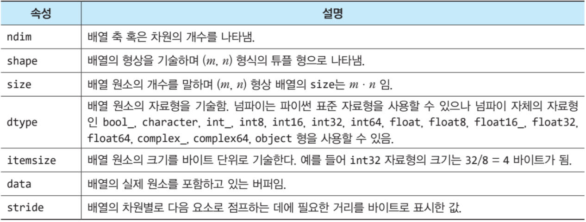

# 🔴 이 글을 쓰기 위해 참고한 영상 / 사이트 
[[블로그]넘파이 다차원 배열](https://velog.io/@jhdai_ly/%EB%84%98%ED%8C%8C%EC%9D%B4Numpyn%EC%B0%A8%EC%9B%90-%EB%B0%B0%EC%97%B4-%EA%B0%9C%EB%85%90-%EC%83%9D%EC%84%B11-ndarray-shape-ndim-size-dtype)  
# 개요
넘파이는 파이썬에서 과학 계산을 위해 널리 사용되는 `라이브러리`이다.  
`대규모 다차원 배열과 행렬 연산`에 사용되며, 이를 위한 효율적인 내장 함수들을 제공한다.  
  
## 넘파이의 특징
`고성능 다차원 배열 객체를 제공`  
넘파이는 빠르고 효율적인 다차원 배열 객체를 제공하는데,   
이 배열 객체가 수학적 연산에 최적화되어 있으며 `대규모 데이터`를 처리하는데 유용하다고 한다.  

`빠른 배열 연산`  
넘파이는 다차원 배열 간의 연산을 쉽고 빠르게 할 수 있도록 돕는다.  
그 연산이라는건 기본적인 수학연산, 고급 선형대수 연산, 푸리에 변환 등이 포함된다.  

`벡터화와 브로드캐스팅 기능`  
넘파이는 다른 크기의 배열 간에도 연산을 쉽게 수행할 수 있는 `브로드캐스팅` 기능을 제공한다.  
또한 `벡터화라는 병렬 연산을 지원하는데 이를 통해 다양한 형태의 데이터처리가 용이하다.  
> 여기서 벡터란 크기와 방향을 가지는 양을 말한다.  
> x, y, z는 3차원 벡터에서 나타나는 것인가 본데.. 일단 스킵
{:.prompt-tip}

`다양하고 강력한 수학 함수`  
넘파이는 수학, 과학 계산을 위한 다양한 내장 함수를 제공한다.  
여기에는 `로그, 난수 생성, 지수, 통계, 확률 분포, 상관계수 구하기 기능, 선형대수 등을 위한 다양한 함수가 포함된다.  

`C, C++, 포트란 코드와의 통합`  
넘파이는 C나 C++ 같은 저수준 언어로 작성된 코드와 쉽게 통합이 가능하여, 성능이 중요한 어플리케이션에서 효율적으로 사용이 가능하다.  

`기계학습 라이브러리 기반`  
넘파이는 판다스, 사이킷런, 텐서플로와 같은 데이터 분석과 기계학습 라이브러리의 기반이 되는 라이브러리이다.  
> 이 중 텐서플로는 구글 랩에서 만들었으며, 구글의 방대한 데이터를 활용해 텐서플로를 학습시켰다.
{:.prompt-tip}
  
## 파이썬의 리스트와 넘파이의 배열
파이썬에는 리스트(list) 라는 자료형이 있다.  
주로 값을 정리하고 그 형태는 일반적인 배열과 유사하다.  
넘파이에도 배열이라는 것이 있는데, 리스트와 유사하지만,  
차이는 무엇이냐 하면은 `계산 성능`이다.  

`다차원배열 ndarray`  
넘파이는 대용량의 배열과 행렬 연산을 수행하는 고차원적인 수학연산자와 함수를 포함하고 있으며, 성능이 우수한 다차원 배열`ndarray` 객체를 제공한다.  ( 후술 )
  
`데이터를 읽는 속도가 리스트에 비해 빠르다`  
파이썬의 리스트는 `동일하지 않은 자료형을 가진 항목들을 담을 수 있고, 이 경우 원소에 접근하는 속도가 매우 느려진다`  
  
반면에, 넘파이의 ndarray 객체는 C, C++, Java 같이 동일한 자료형의 항목들만 저장이 가능해 원소에 접근하는 속도가 상대적으로 빠른것이다.  
  
> 리스트는 여러 데이터를 단순나열하는 식이지만,  
> 넘파이는 선형대수의 벡터 개념으로 다룬다. 
{:.prompt-tip}
  
tip의 의미는 다음과 같다.  
```python
store_a = [20, 10, 30] # 파이썬 List.  매장 A의 매출이다
store_b = [70, 90, 70] 

# 매장 A와 B의 매출을 합하여 지난 3개월간의 매출을 확인한다면?
sum = store_a + store_b
print(sum)

# 결과는 [20, 10, 30, 70, 90, 70]
```
파이썬 리스트의 경우 산술연산자 +를 이용해 결과를 보려하면, 개별의 값을 더하는 것이 아닌 단순히 리스트와 리스트를 연결지어버린다.  
  
이는 리스트를 이루는 원소들의 Index가 단순히 원소들의 순서를 나타내기 때문이고,  
원하던 값인 각 리스트들의 원소들끼리의 합을 구하려면 같은 Index를 각각 더해줘야 한다.  

넘파이에서는 대응되는 Index들이 더해지고 뺄 수 있는 연관된 데이터라고 가정한다. ( 데이터를 벡터로 간주 )  

그리고, 앞서 말한 ndarray을 활용해 파이썬 리스트로 넘파이 배열을 만들 수 있다.  
```python
import numpy as np # 넘파이를 쓰기 위해선 import 해주어야한다.
np_store_a = np.array(store_a)
np_store_b = np.array(store_b)

sum = np_store_a + np_store_b # 넘파이 배열의 덧셈
print(sum)
# array([90, 100, 100])
```
### 다차원 배열
넘파이의 핵심적인 객체는 다차원 배열이라 할 수 있다.  

n차원 배열에 대한 기본 개념이다.  
처음 배열부터 차례대로 1차원, 2차원, 3차원 배열이라고 부르며  
1차원 배열 - axis(축) : 0으로 구성 / Vector라고 부르고,  
2차원 배열 - axis(축) : 0, 1으로 구성 / Matrix라고 부르고,   
3차원 배열 - axis(축) : 0, 1, 2으로 구성 / Tensor라고 부른다.  
이 다차원 배열의 내용물을 성분 / 요소(element) / 항목 (item) 이라고 한다.  
또한, 리스트처럼 index라고 불리는 정수를 사용하여 참조도 가능하다.  

### 넘파이에서 제공하는 다차원 배열 클래스 ndarray
- C 언어에 기반한 배열 구조이므로 메모리를 적게 차지하고 속도가 빠르다.  
- 배열과 배열 간의 수학적인 벡터 연산을 이용할 수 있다.  
- 고급연산자와 풍부한 함수들을 제공한다.  
파이썬에서 넘파이 배열을 만들었다고 가정했을 때, 넘파이 배열이 가지는 속성들로는 이렇게 있다.  

그 중에서도, 가장 많이 사용하는 shape 속성은 다차원 배열에서 형상을 알기쉽게 ( 몇행 몇열 ) 나타내준다.  
  
`넘파이 배열의 데이터 타입을 정하는 법 dtype`  
넘파이 배열은 배열 원소의 데이터 타입을 정하는 법이 두 가지가 있다.  
왜 정하는가에서는 데이터 타입을 명확히 해서 불필요한 메모리 사용 이나 혹시모를 에러를 방지한다고는 한다..?  
```python
# np의 int32 속성값으로 지정하기
a = np.array([1, 2, 3, 4], dtype = np.int32)

# 'int32'처럼 문자열식으로 지정하기 
a = np.array([1, 2, 3, 4], dtype = 'int32')
```