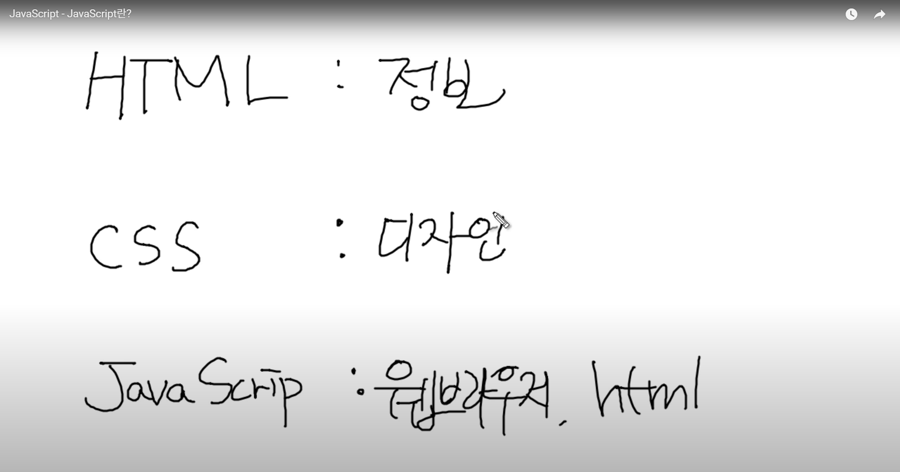

# 🔴 이 글을 쓰기 위해 참고한 영상 / 사이트

[[사이트]자바스크립트란?](https://ko.javascript.info/intro)

## 나와 자바스크립트 이야기

글에 앞서 필자는 인생에서 자바스크립트(이하 JS)와는 연이 없다기 보다는 관심을 안주던 사이에 가까운 편이다. ( 웹 개발자를 목표로 한다는 놈이 )

JS를 아예 안써보았다기 보다는, 지금 기준으로 4년전인 2021년도에 HTML, CSS, JS를 써서 간단한 웹사이트를 만들어 봤을 때 조금 써보았었던 경험이 전부다.

우선 이렇게 JS에 대한 내용을 기술해보려는 것은, 사이트를 참고하면서 내가 이해한 것이나 몰랐던 사실에 대해 기술해보려하는 것도 목적이지만 가끔 터무니없는 생각을 적어볼 수도 있음에 혹시라도 읽게되는 분들이 있다면 널리 양해를 먼저 구해본다.

## 자바스크립트? JS란..

이 JS란 무엇인가? 라고 하면은..  
"웹 페이지에 생동감을 불어넣기 위해" 만들어진 프로그래밍 언어 까지는 알고있었던 사실이다.

이 생동감을 불어넣는다는게 와닿지 않아서 영상을 하나 봤다.
[](https://www.youtube.com/watch?v=QbnpmgRVtjU)

보아하니, 대체로 HTML은 정보  
CSS는 디자인적으로 웹사이트를 꾸며주며,  
JavaScript는 HTML 및 CSS를 제어하는 역할이라고 한다.

그 이외에는 앞서 올린 사이트 부분 참조하였다.  
정리하면,

- JS 로 작성한 프로그램은 Script(스크립트) 라고 불린다.  
  이는 알다시피, 내부의 HTML의 그 Script 가 맞다.  
  스크립트는 특별한 준비 및 컴파일 없이 보통의 문자 형태로 작성하며, 실행도 가능하다.
- JS는 브라우저 뿐만이 아닌, 서버에서도 실행이 가능하다 (+ 자바스크립트 엔진).
- 브라우저에는 각각 자체 JS 가상엔진이 내장되어 있다.

브라우저에서 JS는 "웹사이트를 제어" 하는 프로그래밍 언어인만큼, 매우 강력해보이는데  
이를 우려한 것인지 보안 문제와 더불어 JS의 기능을 일부 제한하여 브라우저에서 할 수 있는 일과 못하는 일이 나누어지게 되었다.

## 🟠 JS가 브라우저에서 할 수 있는 일이라면?

브라우저에서 할 수 있는 일이라면, 다음과 같이 있다.

- 페이지에 새로운 HTML 추가 혹은 기존 HTML이나 CSS를 수정하기
- 클릭이나 포인터의 움직임 같은 이벤트 / 트리거에 반응하기
- 네트워크를 통해 원격 서버에 요청, 다운로드, 업로드
- 쿠키를 가져오거나 설정, 사용자에게 질문을 건네거나 메시지를 보여줌
- 클라이언트 측 로컬 저장소에 데이터를 저장하기.

예전에 html / css만으로 웹사이트를 만들었을 때에도 사이트 만드는데 참고삼아 여러 사이트들을 방문하여 개발자 도구(F12) 으로 해당 사이트의 구조 등을 참고하며 가끔은 코드도 수정해보고 했었던 게 기억이 난다.

가끔 뜨는 알림 창이라던가 쿠키를 저장하겠단 메시지 등이 모두 JS의 일 중 하나라고 생각하면 되겠다.

## 🟠 JS가 브라우저에서 할 수 없는 일이라면?

보안을 위해 브라우저에서 JS의 기능에 제약을 걸어놓았다고 하였다.  
이를테면, 아까 나처럼 사이트의 일부 기능을 건드리는 행동을 한다던지..  
나쁘게는 악성 페이지가 개인 정보에 접근 및 사용자의 데이터를 손상하는 행위를 막기 위해 만들어졌다.

- 웹페이지 내 스크립트는 디스크의 저장된 임의의 파일을 읽거나 쓰고, 복사하거나 실행할 때 제약을 받습니다.  
  특히 뭐 카메라나 마이크 같은 민감한 정보가 될 수 있는 디바이스와 상호 작용하려면 사용자의 명시적인 허가가 있어야한다.
- 브라우저 내 탭과 창은 서로의 정보를 알 수 없다. ( 하지만 예외 사항 존재 )
- JS를 이용하면 페이지를 생성한 서버와 쉽게 정보를 주고받을 수 있지만, 타 사이트나 도메인에서 데이터를 받아오는 것은 불가능하다.  
  다만, 서버에서라면 이러한 제약은 존재하지 않는다.

## 🟠 그래서 JS를 쓰는 이유

- HTML/CSS와 완전히 통합할 수 있음  
  근래의 웹사이트들은 JS가 없는 웹사이트는 찾아보기 힘들 정도로 JS는 거의 웹사이트의 필수품이라고 볼 수 있을 정도이다.
- 간단한 일은 간단하게 처리할 수 있게 해줌  
  이건 아직 JS를 완벽하게 다루지 않아서, 아직 와닿지는 않는다.
- 모든 주요 브라우저에서 지원 및 기본 언어로 사용됨.

## 🟠 JS로 트랜스파일 하는 언어들

TS라던가, Dart는 이전에 배워보려고 시도했었던 것들인데, 그때도 JS를 트랜스파일한다 정도는 알고 있었다.

JS를 조금 더 세부적으로 들어가면 여러 문제점이 있는데 그 중 한 가지 생각난걸 말해보자면 JS는 실행을 할 때 대개 오류를 안뱉는다는거?

예를 들어, JS에서 배열을 생성하고 여기에 boolean 값을 더해보면
보통 프로그래밍 언어에서는 에러를 낼 것이다.

```javascript
[1, 2, 3, 4] + false;

//'1,2,3,4false'
```

이런식으로, 에러를 내지 않고 정상적으로 출력이 된다는 것.  
자료형의 명시화에 집중해 만들어진 TypeScript는 기존 JS의 엄격하지 않은 자료형을 고쳐 방금과 같은 코드도 에러를 출력해준다.

다만, 어디까지나 다른 언어가 아닌 JS의 변환 형태이기에 근본은 JS다 라는 사실을 기억하면 좋을 것 같다.

## 🟠 여담

생각해보니, TS를 배우려 했을 때에도 솔직히 JS문법을 더 공부했었던 것 같다.
